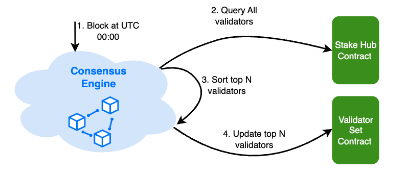

# BNB 智能链

## 目录

- [BNB 智能链](#BNB-智能链)
- [动机](#动机)
- [BNB 链的演进](#BNB链的演进)
- [设计原则](#设计原则)
- [代币经济](#代币经济)
  - [原生代币](#原生代币)
  - [种子基金](#种子基金)
  - [实时销毁](#实时销毁)
- [共识和验证人法定人数](#共识和验证人法定人数)
  - [质押权威证明](#质押权威证明)
  - [验证人集合](#验证人集合)
  - [验证人选举](#验证人选举)
- [系统合约](#系统合约)
- [奖励分配](#奖励分配)
- [安全性和最终性](#安全性和最终性)
- [治理](#治理)
- [惩罚和处罚](#惩罚和处罚)
  - [双重签名](#双重签名)
  - [恶意快速最终性投票](#恶意快速最终性投票)
  - [不可用性](#不可用性)
- [展望](#展望)

## 动机

自2019年4月主网社区启动以来，信标链展示了其高速和大吞吐量的设计。信标链的主要焦点是支持一个原生的、低延迟、高性能的去中心化交易所。其中最受欢迎的功能之一是可编程的可扩展性，特别是智能合约和虚拟机功能的实现。为了满足这一需求，我们提出了与信标链并行运行的BNB智能链，以促进一个用户友好的智能合约环境。

BNB智能链（BSC）是一个与EVM兼容的区块链，旨在为BNB链生态系统带来可编程性和互操作性。作为更广泛的BNB链的一部分，BSC旨在为去中心化应用（dApps）和数字资产提供高吞吐量、低延迟和低成本的环境。本白皮书概述了BSC的架构、机制和演进历程。虽然已经过去几年，我们仍然保留这份文件，因为它继续作为一个有用的参考，并准确地代表BNB智能链。

## BNB链的演进

- **初始启动和信标链。** 信标链于2019年4月启动，旨在支持BNB DEX，具备快速交易和大吞吐量的特性。然而，其缺乏可编程性和智能合约功能对开发者和用户造成了限制。

- **BNB智能链的引入。** 为了解决这些限制，BNB智能链于2020年引入，利用并行区块链架构支持智能合约，同时保持DEX的高性能。

- **BNB链融合。** 2023年11月，BNB链融合提案（[BEP-333](https://github.com/binance-chain/BEPs/blob/master/BEP333.md)）标志着一个重大转变。这个提案概述了信标链的终结，将其功能与BSC合并，创建一个统一的高性能区块链网络。这次融合旨在简化操作，增强安全性，并简化BSC上的用户体验。

- **opBNB。** 于2023年推出，opBNB是一个基于Optimism OP Stack的以太坊虚拟机（EVM）兼容的Layer 2链。它旨在通过提供更低的gas费用和高性能区块链技术来革新区块链行业。

- **BNB Greenfield。** Greenfield是一个新颖的去中心化数据存储网络，与BNB智能链（BSC）有原生桥接，管理用户权限、存储桶创建和文件删除，从而改变用户与其数据交互的方式。

BNB链是一个不断发展的生态系统，BSC是其核心。作为一个关键的金融系统，BSC承载着最多的加密资产价值。它还作为opBNB和其他Layer 2解决方案的结算和数据可用性层，确保layer2的安全性。此外，BSC作为Greenfield的智能合约编程平台，促进Greenfield内的数据交换和流通。

BSC从最初的双链架构（其中质押、验证和治理委托给信标链）发展到现在，经历了显著的演变。在BNB链融合之后，BSC经历了实质性的架构变更，最终成为一个完全独立的区块链。

## 设计原则

以下是BSC的设计原则：

1. **独立区块链：** 从技术上讲，BSC是一个独立的区块链，而不是一个layer-2解决方案。BSC的大多数基本技术和业务功能应该是自驱动的。

2. **以太坊兼容性：** 以太坊是第一个实用且广泛使用的智能合约平台。为了利用相对成熟的应用和社区，BSC选择与现有的以太坊主网兼容。这意味着大多数dApps、生态系统组件和工具无需或只需最小的更改就能与BSC一起工作；BSC节点将需要类似（或稍高）的硬件规格和技能来运行和操作。BSC的实现具备跟上以太坊的进一步升级的能力。

3. **涉及质押的共识和治理：** 基于质押的共识更加环保，并为社区治理留下更灵活的选择。预期这种共识应能实现比[工作量证明](https://en.wikipedia.org/wiki/Proof_of_work)区块链系统更好的网络性能，即更快的出块时间和更高的交易容量。

4. **快速出块时间和快速最终性：** BSC将实施快速最终性机制，允许在正常情况下在两个区块确认内完成区块最终性。这一特性，结合BSC 3秒的快速出块时间，提供了近乎即时的交易最终性和良好的用户体验。

## 代币经济

BSC、opBNB和Greenfield共享BNB这一统一代币。这定义了：

1. BNB可以在所有网络上流通，并通过跨链通信机制流动。
2. BNB的总流通量应在三个网络中管理，即BNB的总有效供应量应是所有网络中代币总有效供应量的总和。

### 原生代币

BNB将在BSC上运行，就像ETH在以太坊上运行一样，因此它仍然是BSC的"原生代币"。这意味着BNB将用于：

1. 支付在BSC上部署智能合约的"费用"。
2. 在选定的BSC验证人上进行质押，并获得相应的奖励。
3. 执行跨链操作，如在BSC、opBNB和Greenfield之间转移代币资产。

### 种子基金

在BSC的创世阶段，一定数量的BNB将在信标链上销毁，并在BSC上铸造。这个数量被称为"种子基金"，在第一个区块后在BSC上流通以分配给在创世时引入的初始验证人集合。

### 实时销毁

为了加速BNB的销毁过程并使BSC更加去中心化，部分gas费将被销毁。每个区块中，验证人收集的gas费的固定比例将被销毁。销毁比例可由BSC验证人治理设置。

## 共识和验证人法定人数

基于上述设计原则，BSC的共识协议旨在实现以下目标：

1. 出块时间应比以太坊网络更短，例如3秒。
2. 确认交易最终性需要有限的时间，例如大约10秒级或更短。
3. 原生代币BNB没有通胀：区块奖励从交易费中收集，并将以BNB支付。
4. 尽可能与以太坊系统兼容。
5. 允许权益证明区块链网络治理。

### 质押权威证明

尽管[工作量证明（PoW）](https://en.wikipedia.org/wiki/Proof_of_work)被认为是实现去中心化网络的实用机制，但它对环境不友好，而且还需要大量参与者来维护安全性。

以太坊和一些其他区块链网络，如MATIC Bor、TOMOChain、GoChain、xDAI，在不同场景中使用[权威证明（PoA）](https://en.wikipedia.org/wiki/Proof_of_authority)或其变体，包括测试网和主网。PoA提供了对51%攻击的一些防御，提高了效率，并对某些程度的拜占庭参与者（恶意或被黑客入侵）具有容忍度。

同时，PoA协议最受批评的是不如PoW去中心化，因为验证人（即轮流产生区块的节点）拥有所有权力，容易受到腐败和安全攻击。其他区块链，如EOS和Lisk，引入了不同类型的[委托权益证明（DPoS）](https://en.wikipedia.org/wiki/Delegated_proof_of_stake)，允许代币持有者投票选举验证人集合。这增加了去中心化程度，有利于社区治理。

BSC在这里提议将DPoS和PoA结合用于共识，以便：

1. 区块由有限的验证人集合产生。
2. 验证人以PoA方式轮流产生区块，类似于以太坊的Clique共识设计。
3. 验证人集合基于基于质押的治理进行选举和退出。
4. 为了增强网络容量，允许验证人在指定参数内产生连续区块。

### 验证人集合

验证人集合是负责验证交易和在BSC上产生区块的节点组。验证人集合由每个验证人的质押量决定，这反映了验证人及其委托人质押的BNB数量。拥有最多质押的顶级验证人被选为活跃验证人集合，他们轮流提议和投票区块。其余的验证人在备用验证人集合中，如果他们的质押增加或某些活跃验证人退出，他们可以加入活跃验证人集合。

任何组织或个人都可以通过在链上创建他们的验证人并获得足够的委托来成为验证人集合的一部分。同样，他们也可以通过简单地撤回所有BNB委托来选择退出。验证人也可能因为行为不当或离线而被惩罚（slashing）从验证人集合中移除。

在创世阶段，一些受信任的节点将作为初始验证人集合运行。在区块开始产生后，任何人都可以竞争加入成为候选人，以当选为验证人。

### 验证人选举

验证人有不同的角色：

- **内阁：** 前K个（将是21个）获得最多出块机会的验证人。
- **候选人：** 前(K, K+NumOfCandidates]个获得少量出块机会的验证人。
- **非活跃：** 其余没有出块机会的验证人。

验证人集合角色每24小时根据最新的质押信息确定一次。在UTC 00:00之后，共识引擎对验证人进行排序，并用排名信息更新BSC验证人集合。

### 系统合约

有几个内置合约（即系统合约）来促进BSC的质押和验证人选举。

- **验证人集合合约：** 该合约定期选举验证人集合。该合约还作为临时存储验证人奖励的保险库。

- **系统奖励合约：** 此合约作为收集部分交易费用的保险库。这些资金用于各种公共目的，如分发快速最终性奖励。

- **惩罚合约：** 此合约用于跟踪验证人变得不可用的次数，并在达到某个阈值时触发惩罚。此外，该合约还处理其他类型的惩罚事件，如双重签名和快速最终性中的恶意投票。

- **质押中心合约：** 此合约作为管理验证人和委托的入口点，同时实现惩罚特定验证人的逻辑。对于委托/解除委托/重新委托操作，它将调用不同验证人的实现合约来管理用户的质押。

### 奖励分配
质押奖励来自交易费用 - 当一个区块被产生时，大部分区块费用将作为奖励收集给提议该区块的验证人。

每天，收集的奖励的一部分将直接作为佣金发送到验证人的操作员账户，而剩余部分将发送到相应的验证人信用合约。当用户解除委托并申领其质押时，累积的奖励和原始质押将返还给他/她。

## 安全性和最终性
假设有超过(N/2+1)的验证人是诚实的，基于PoA的网络通常能安全且正常工作。然而，仍有某些拜占庭验证人可能设法攻击网络的情况，例如通过"[克隆攻击](https://arxiv.org/pdf/1902.10244.pdf)"。为了确保与BC一样安全，建议BSC用户等待接收到超过2⁄3N+1个不同验证人密封的区块。这样，BSC可以被信任到与BC类似的安全级别，并且可以容忍少于1⁄3*N的拜占庭验证人。

除了概率性最终性，BSC提出了一种快速最终性机制来最终确定一个区块，一旦区块被最终确定，它将永远不会被回滚。其想法与[Casper FFG](https://arxiv.org/pdf/1902.10244.pdf)非常相似。最终确定一个区块需要几个步骤：

1. 一个区块由一个验证人提议并传播给其他验证人。
2. 验证人使用他们的BLS私钥为区块签名作为投票消息。
3. 将验证人的投票收集到一个池中。
4. 在提议新区块时，如果其直接父区块已获得足够的投票，则聚合BLS签名。
5. 将聚合的投票证明设置到新区块头的额外字段中。
6. 接收到带有直接父区块证明的新区块的验证人和全节点可以证明直接父区块。
7. 如果两个连续的区块都被证明，那么前一个区块就被最终确定。

## 治理
BSC引入了原生治理模块，灵感来自OpenZeppelin Governor。以下是BSC治理的主要特点：

- **提案和投票权**：质押token持有者可以提出和投票决定治理事务。
- **持续奖励**：投票者在投票期间可以继续获得质押奖励。
- **灵活委托**：用户可以委托他们的投票权，使其他人能够参与治理。
- **安全执行**：提案一旦通过，在执行前会经过一个时间锁定期。

BNB Chain的治理涉及两个步骤：**热点测试**和**最终决策投票**。热点测试通常通过[Snapshot](https://snapshot.org/#/)平台进行，允许任何BNB持有者评估社区对提案是否感兴趣。如果提案获得足够的支持，它将进入最终决策投票阶段。这个阶段通常涉及验证者或那些质押了BNB的人进行链上投票，结果决定提案是否被实施或拒绝。

## 惩罚和处罚
惩罚是链上治理的一个组成部分，用于惩罚恶意或负面行为。任何人都可以在BSC上提交惩罚交易，这涉及提供证据和惩罚作恶者。成功的提交将获得可观的奖励。目前，有三种可惩罚的情况。

### 双重签名
当一个验证者为具有相同高度和父区块的多个区块签名时，这是一个相当严重的错误，很可能是故意的违规行为。参考协议实现应该已经有逻辑来防止这种情况，所以只有恶意代码才能触发这种情况。当发生双重签名时，验证者应立即从验证者集合中移除。

任何人都可以向BSC惩罚合约提交带有双重签名证据的惩罚交易，该证据应包含由违规验证者封存的具有相同高度和父区块的两个区块头。在收到证据后，合约将验证其有效性。

验证者将从验证者集合中移除，预定数量的BNB将从验证者的自委托BNB中扣除。

### 恶意快速最终性投票
当验证者为具有相同目标高度的两个快速最终性投票签名，或者一个投票的范围包含另一个投票的范围时，这也是一个严重的错误。参考协议实现应该已经有逻辑来防止这种情况，所以只有恶意代码才能触发这种情况。当发生**恶意投票**时，验证者应立即从验证者集合中移除。

任何人都可以向BSC惩罚合约提交带有恶意投票证据的惩罚交易。需要提供恶意投票的证据，包括两个冲突的投票和用于签名的投票公钥。在收到证据后，合约将验证其有效性。验证者将从当前验证者集合中移除，提交者将从系统合约获得奖励。

### 不可用性
BSC的活跃性依赖于权益证明授权验证者集合中的每个人在轮到他们时及时产生区块。验证者可能因为任何原因错过他们的回合，特别是硬件、软件、配置或网络问题。这种操作的不稳定性将损害性能并给系统引入更多的不确定性。

BSC有一个内部智能合约记录每个验证者的错过区块数量。如果这个指标超过设定的阈值，验证者的区块奖励将不会给予他们，而是与表现更好的其他验证者共享。这个过程旨在逐步从集合中移除运营不佳的验证者，减少他们的委托者的奖励。

如果指标保持在更高的阈值以上，验证者将从轮换中移除，并从他们的自委托BNB中扣除一定数量的BNB。这个行为导致验证者和委托者都无法获得他们的质押奖励。

## 展望
我们很难对BNB Chain下定论，因为它从未停止发展。以下是我们目前最关注的主题，这些特性的发展会为社区提供更好的可用性和可扩展性：

- **并行EVM**。并行EVM是EVM的一个扩展，允许它并行执行多个指令，从而提高网络的性能。
- **状态过期**。通过移除过期的存储状态，解决BNB智能链上不断增加的世界状态存储问题。
- **持续进一步去中心化**。
- **大规模采用基础设施**。BNB Chain社区致力于确保公共基础设施是一流的，并为大规模应用提供基础构建块。