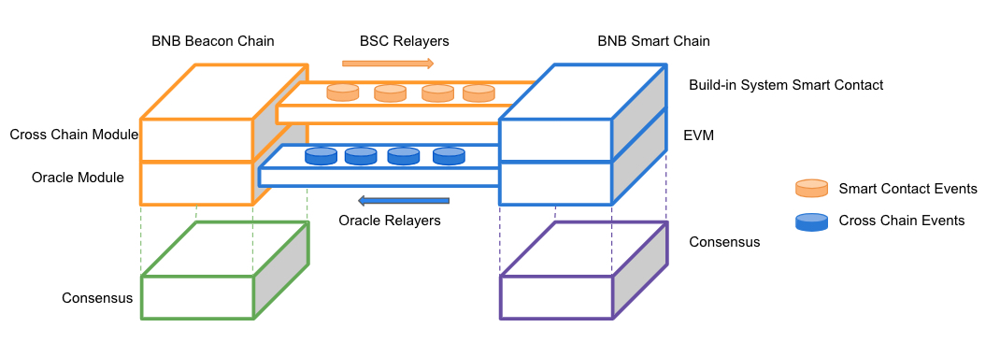

# Binance Smart Chain
**A Parallel Binance Chain to Enable Smart Contracts**

_NOTE: This document is under development. Please check regularly for updates!_

## Table of Contents
- [Motivation](#motivation)
- [Design Principles](#design-principles)
- [Consensus and Validator Quorum](#consensus-and-validator-quorum)
  * [Proof of Staked Authority](#proof-of-staked-authority)
  * [Validator Quorum](#validator-quorum)
  * [Security and Finality](#security-and-finality)
  * [Reward](#reward)
- [Token Economy](#token-economy)
  * [Native Token](#native-token)
  * [Other Tokens](#other-tokens)
- [Cross-Chain Transfer and Communication](#cross-chain-transfer-and-communication)
  * [Cross-Chain Transfer](#cross-chain-transfer)
  * [BC to BSC Architecture](#bc-to-bsc-architecture)
  * [BSC to BC Architecture](#bsc-to-bc-architecture)
  * [Timeout and Error Handling](#timeout-and-error-handling)
  * [Cross-Chain User Experience](#cross-chain-user-experience)
  * [Cross-Chain Contract Event](#cross-chain-contract-event)
- [Staking and Governance](#staking-and-governance)
  * [Staking on BC](#staking-on-bc)
  * [Rewarding](#rewarding)
  * [Slashing](#slashing)
- [Relayers](#relayers)
  * [BSC Relayers](#bsc-relayers)
  * [Oracle Relayers](#oracle-relayers)
- [Outlook](#outlook)
# Motivation

After its mainnet community [launch](https://www.binance.com/en/blog/327334696200323072/Binance-DEX-Launches-on-Binance-Chain-Invites-Further-Community-Development) in April 2019, [Binance Chain](https://www.binance.org) has exhibited its high speed and large throughput design. Binance Chain’s primary focus, its native [decentralized application](https://en.wikipedia.org/wiki/Decentralized_application) (“dApp”) [Binance DEX](https://www.binance.org/trade), has demonstrated its low-latency matching with large capacity headroom by handling millions of trading volume in a short time.

Flexibility and usability are often in an inverse relationship with performance. The concentration on providing a convenient digital asset issuing and trading venue also brings limitations. Binance Chain's most requested feature is the programmable extendibility, or simply the [Smart Contract](https://en.wikipedia.org/wiki/Smart_contract) and Virtual Machine functions. Digital asset issuers and owners struggle to add new decentralized features for their assets or introduce any sort of community governance and activities.

Despite this high demand for adding the Smart Contract feature onto Binance Chain, it is a hard decision to make. The execution of a Smart Contract may slow down the exchange function and add non-deterministic factors to trading. If that compromise could be tolerated, it might be a straightforward idea to introduce a new Virtual Machine specification based on [Tendermint](https://tendermint.com/core/), based on the current underlying consensus protocol and major [RPC](https://docs.binance.org/api-reference/node-rpc.html) implementation of Binance Chain. But all these will increase the learning requirements for all existing dApp communities, and will not be very welcomed.

We propose a parallel blockchain of the current Binance Chain to retain the high performance of the native DEX blockchain and to support a friendly Smart Contract function at the same time.

# Design Principles

After the creation of the parallel blockchain into the Binance Chain ecosystem, two blockchains will run side by side to provide different services. The new parallel chain will be called “**Binance Smart Chain**” (short as “**BSC**” for the below sections), while the existing mainnet remains named “**Binance Chain**” (short as “**BC**” for the below sections).

Here are the design principles of **BSC**:

1. **Standalone Blockchain**: technically, BSC is a standalone blockchain, instead of a layer-2 solution. Most BSC fundamental  technical and business functions should be self-contained so that it can     run well even if the BC stopped for a short period.
2. **Ethereum  Compatibility**: The first practical and widely-used Smart Contract platform is Ethereum. To take advantage of the relatively mature applications and community, BSC chooses to be compatible with the existing Ethereum mainnet. This means most of the **dApps**, ecosystem components, and toolings will work with BSC and require zero or minimum changes; BSC node will require similar (or a bit higher) hardware specification and skills to run and operate. The implementation should leave room for BSC to catch up with further Ethereum upgrades.
3. **Staking Involved  Consensus and Governance**: Staking-based consensus is more environmentally friendly and leaves more flexible option to the community governance. Expectedly, this consensus should enable better network performance over [proof-of-work](https://en.wikipedia.org/wiki/Proof_of_work) blockchain system, i.e., faster blocking time and higher transaction capacity.
4. **Native Cross-Chain Communication**: both BC and BSC will be implemented with native support for cross-chain communication among the two blockchains. The communication protocol should be bi-directional, decentralized, and trustless. It will concentrate on moving digital assets between BC and BSC, i.e., [BEP2](https://github.com/binance-chain/BEPs/blob/master/BEP2.md) tokens, and eventually, other BEP tokens introduced later. The protocol should care for the minimum of other items stored in the state of the blockchains, with only a few exceptions.

# Consensus and Validator Quorum

Based on the above design principles, the consensus protocol of BSC is to fulfill the following goals:

1. Blocking time should be shorter than Ethereum network, e.g. 5 seconds or even shorter.
2. It requires limited time to confirm the finality of transactions, e.g. around 1-min level or shorter.
3. There is no inflation of native token: BNB, the block reward is collected from transaction fees, and it will be paid in BNB.
4. It is compatible with Ethereum system as much as possible.
5. It allows modern [proof-of-stake](https://en.wikipedia.org/wiki/Proof_of_stake) blockchain network governance.

## Proof of Staked Authority

Although Proof-of-Work (PoW) has been recognized as a practical mechanism to implement a decentralized network, it is not friendly to the environment and also requires a large size of participants to maintain the security.

Ethereum and some other blockchain networks, such as [MATIC Bor](https://github.com/maticnetwork/bor), [TOMOChain](https://tomochain.com/), [GoChain](https://gochain.io/), [xDAI](https://xdai.io/), do use [Proof-of-Authority(PoA)](https://en.wikipedia.org/wiki/Proof_of_authority) or its variants in different scenarios, including both testnet and mainnet. PoA provides some defense to 51% attack, with improved efficiency and tolerance to certain levels of Byzantine players (malicious or hacked). It serves as an easy choice to pick as the fundamentals.

Meanwhile, the PoA protocol is most criticized for being not as decentralized as PoW, as the validators, i.e. the nodes that take turns to produce blocks, have all the authorities and are prone to corruption and security attacks. Other blockchains, such as EOS and Lisk both, introduce different types of [Delegated Proof of Stake (DPoS)](https://en.bitcoinwiki.org/wiki/DPoS) to allow the token holders to vote and elect the validator set. It increases the decentralization and favors community governance.

BSC here proposes to combine DPoS and PoA for consensus, so that:
1. Blocks are produced by a limited set of validators
2. Validators take turns to produce blocks in a PoA manner, similar to [Ethereum’s Clique](https://eips.ethereum.org/EIPS/eip-225) consensus design
3. Validator set are elected in and out based on a staking based governance

## Validator Quorum

In the genesis stage, a few trusted nodes will run as the initial Validator Set. After the blocking starts, anyone can compete to join as candidates to elect as a validator. The staking status decides the top 21 most staked nodes to be the next validator set, and such an election will repeat every 24 hours.

**BNB** is the token used to stake for BSC.

In order to remain as compatible as Ethereum and upgradeable to future consensus protocols to be developed, BSC chooses to rely on the **BC** for staking management (Please refer to the below “[Staking and Governance](#staking-and-governance)” section). There is a **dedicated staking module for BSC on BC**. It will accept BSC staking from BNB holders and calculate the highest staked node set. Upon every UTC midnight, BC will issue a verifiable `ValidatorSetUpdate` cross-chain message to notify BSC to update its validator set.

While producing further blocks, the existing BSC validators check whether there is a `ValidatorSetUpdate` message relayed onto BSC periodically. If there is, they will update the validator set after an **epoch period**, i.e. a predefined number of blocking time. For example, if BSC produces a block every 5 seconds, and the epoch period is 240 blocks, then the current validator set will check and update the validator set for the next epoch in 1200 seconds (20 minutes).

## Security and Finality

Given there are more than ½\*N+1 validators are honest, PoA based networks usually work securely and properly. However, there are still cases where certain amount Byzantine validators may still manage to attack the network, e.g. through the “[Clone Attack](https://arxiv.org/pdf/1902.10244.pdf)”. To secure as much as BC, BSC users are encouraged to wait until receiving blocks sealed by more than ⅔\*N+1 different validators. In that way, the BSC can be trusted at a similar security level to BC and can tolerate less than ⅓\*N Byzantine validators.

With 21 validators, if the block time is 5 seconds, the ⅔\*N+1 different validator seals will need a time period of (⅔\*21+1)*5 = 75 seconds. Any critical applications for BSC may have to wait for ⅔\*N+1 to ensure a relatively secure finality. However, besides such arrangement, BSC does introduce **Slashing** logic to penalize Byzantine validators for **double signing** or **inavailability**, which will be covered in the “Staking and Governance” section later. This Slashing logic will expose the malicious validators in a very short time and make the “Clone Attack” very hard or extremely non-beneficial to execute. With this enhancement, ½\*N+1 or even fewer blocks are enough as confirmation for most transactions.

## Reward

All the BSC validators in the current validator set will be rewarded with transaction **fees in BNB**. As BNB is not an inflationary token, there will be no mining rewards as what Bitcoin and Ethereum network generate, and the gas fee is the major reward for validators. As BNB is also utility tokens with other use cases, delegators and validators will still enjoy other benefits of holding BNB.

The reward for validators is the fees collected from transactions in each block. Validators can decide how much to give back to the delegators who stake their BNB to them, in order to attract more staking. Every validator will take turns to produce the blocks in the same probability (if they stick to 100% liveness), thus, in the long run, all the stable validators may get a similar size of the reward. Meanwhile, the stakes on each validator may be different, so this brings a counter-intuitive situation that more users trust and delegate to one validator, they potentially get less reward. So rational delegators will tend to delegate to the one with fewer stakes as long as the validator is still trustful (insecure validator may bring slashable risk). In the end, the stakes on all the validators will have less variation. This will actually prevent the stake concentration and “winner wins forever” problem seen on some other networks.

Some parts of the gas fee will also be rewarded to relayers for Cross-Chain communication. Please refer to the “[Relayers](#relayers)” section below.

# Token Economy

BC and BSC share the same token universe for BNB and BEP2 tokens. This defines:

1. The same token can circulate on both networks, and flow between them bi-directionally     via a cross-chain communication mechanism.
2. The total circulation of the same token should be managed across the two networks, i.e. the total effective supply of a token should be the sum of the     token’s total effective supply on both BSC and BC.
3. The tokens can be initially created on BSC in a similar format as ERC20 token standard, or on BC as a BEP2, then created on the other. There are native ways on both networks to link the two and secure the total supply of the token.

## Native Token

BNB will run on BSC in the same way as ETH runs on Ethereum so that it remains as “native token” for both BSC and BC. This means, in addition to BNB is used to pay most of the fees on Binance Chain and Binance DEX, BNB will be also used to:

1. pay “fees“ to deploy smart contracts on BSC
2. stake on selected BSC validators, and get corresponding rewards
3. perform cross-chain operations, such as transfer token assets across BC and BSC

### Seed Fund

Certain amounts of BNB will be burnt on BC and minted on BSC during its genesis stage. This amount is called “Seed Fund” to circulate on BSC after the first block, which will be dispatched to the initial BC-to-BSC Relayer(described in later sections) and initial validator set introduced at genesis. These BNBs are used to pay transaction fees in the early stage to transfer more BNB from BC onto BSC via the cross-chain mechanism.

The BNB cross-chain transfer is discussed in a later section, but for BC to BSC transfer, it is generally to lock BNB on BC from the source address of the transfer to a system-controlled address and unlock the corresponding amount from special contract to the target address of the transfer on BSC, or reversely, when transferring from BSC to BC, it is to lock BNB from the source address on BSC into a special contract and release locked amount on BC from the system address to the target address. The logic is related to native code on BC and a series of smart contracts on BSC.

## Other Tokens

BC supports BEP2 tokens and upcoming [BEP8 tokens](https://github.com/binance-chain/BEPs/pull/69), which are native assets transferrable and tradable (if listed) via fast transactions and sub-second finality. Meanwhile, as BSC is Ethereum compatible, it is natural to support ERC20 tokens on BSC, which here is called “**BEP2E**” (with the real name to be introduced by the future BEPs,it potentially covers BEP8 as well). BEP2E may be “Enhanced” by adding a few more methods to expose more information, such as token denomination, decimal precision definition and the owner address who can decide the Token Binding across the chains. BSC and BC work together to ensure that one token can circulate in both formats with confirmed total supply and be used in different use cases.

### Token Binding

BEP2 tokens will be extended to host a new attribute to associate the token with a BSC BEP2E  token contract, called “**Binder**”, and this process of association is called “**Token Binding**”.

Token Binding can happen at any time after BEP2 and BEP2E are ready. The token owners of either BEP2 or BEP2E don’t need to bother about the Binding, until before they really want to use the tokens on different scenarios. Issuers can either create BEP2 first or BEP2E first, and they can be bound at a later time. Of course, it is encouraged for all the issuers of BEP2 and BEP2E to set the Binding up early after the issuance.

A typical procedure to bind the BEP2 and BEP2E will be like the below:

1. Ensure both the BEP2 token and the BEP2E token both exist on each blockchain, with the same total supply. BEP2E should have 3 more methods than typical ERC20 token standard:
    *  symbol(): get token symbol
    *  decimals(): get the number of the token decimal digits
    *  owner(): get **BEP2E contract owner’s address.** This value should be initialized in the BEP2E contract constructor so that the further binding action can verify whether the action is from the BEP2E owner.

2. Decide the initial circulation on both blockchains. Suppose the total supply is *S*, and the expected initial circulating supply on BC is *K*, then the owner should lock S-K tokens to a system controlled address on BC.

3. Equivalently, *K* tokens is locked in the special contract on BSC, which handles major binding functions and is named as **TokenHub**. The issuer of the BEP2E token should lock the *K* amount of that token into TokenHub, resulting in *S-K* tokens to circulate on BSC. Thus the total circulation across 2 blockchains remains as *S*.

4. The issuer of BEP2 token sends the bind transaction on BC. Once the transaction is executed successfully after proper verification:
    * It transfers *S-K* tokens to a system-controlled address on BC.
    * A cross-chain bind request package will be created, waiting for Relayers to relay.

5. BSC Relayers will relay the cross-chain bind request package into **TokenHub** on BSC, and the corresponding request and information will be stored into the contract.

6. The contract owner and only the owner can run a special method of TokenHub contract, `ApproveBind`, to verify the binding request to mark it as a success. It will confirm:
    * the token has not been bound;
    * the binding is for the proper symbol, with proper total supply and decimal information;
    * the proper lock are done on both networks;

10. Once the `ApproveBind` method has succeeded, TokenHub will mark the two tokens are bounded and share the same circulation on BSC, and the status will be propagated back to BC. After this final confirmation, the BEP2E contract address and decimals will be written onto the BEP2 token as a new attribute on BC, and the tokens can be transferred across the two blockchains bidirectionally. If the ApproveBind fails, the  failure event will also be propagated back to BC to release the locked tokens, and the above steps can be re-tried later.

# Cross-Chain Transfer and Communication
Cross-chain communication is the key foundation to allow the community to take advantage of the dual chain structure:

* users are free to create any tokenization, financial products, and digital assets on BSC or BC as they wish
* the items on BSC can be manually and programmingly traded and circulated in a stable, high throughput, lighting fast and friendly environment of BC
* users can operate these in one UI and tooling ecosystem.

## Cross-Chain Transfer

The cross-chain transfer is the key communication between the two blockchains. Essentially the logic is:

1. the `transfer-out` blockchain will lock the amount from source owner addresses into a system controlled address/contracts;
2. the `transfer-in` blockchain will unlock the amount from the system controlled address/contracts and send it to target addresses.

The cross-chain transfer package message should allow the BSC Relayers and BC **Oracle Relayers** to verify:

1. Enough amount of token assets are removed from the source address and locked into a system controlled addresses/contracts on the source blockchain. And this can be confirmed on the target blockchain.
2. Proper amounts of token assets are released from a system controlled addresses/contracts and allocated into target addresses on the target blockchain. If this fails, it can be confirmed on source blockchain, so that the locked token can be released back (may deduct fees).
3. The sum of the total circulation of the token assets across the 2 blockchains are not changed after this transfer action completes, no matter if the transfer succeeds or not.

The architecture of cross-chain communication is as in the above diagram. To accommodate the 2 heteroid systems, communication handling is different in each direction.

## BC to BSC Architecture

BC is a Tendermint-based, instant finality blockchain. Validators with at least ⅔\*N+1 of the total voting power will co-sign each block on the chain. So that it is practical to verify the block transactions and even the state value via **Block Header** and **Merkle Proof** verification. This has been researched and implemented as “**Light-Client Protocol**”, which are intensively discussed in [the Ethereum](https://github.com/ethereum/wiki/wiki/Light-client-protocol) community, studied and implemented for [Cosmos inter-chain communication](https://github.com/cosmos/ics/blob/a4173c91560567bdb7cc9abee8e61256fc3725e9/spec/ics-007-tendermint-client/README.md).

BC-to-BSC communication will be verified in an “**on-chain light client**” implemented via BSC **Smart Contracts** (some of them may be **“pre-compiled”**). After some transactions and state change happen on BC, if a transaction is defined to trigger cross-chain communication,the Cross-chain “**package**” message will be created and **BSC Relayers** will pass and submit them onto BSC as data into the "build-in system contracts". The build-in system contracts will verify the package and execute the transactions if it passes the verification. The verification will be guaranteed with the below design:

1. BC blocking status will be synced to the light client contracts on BSC from time to time, via     block header and pre-commits, for the below information:
    * block and app hash of BC that are signed by validators
    * current validatorset, and validator set update

2. the key-value from the blockchain state will be verified based on the Merkle     Proof and information from above #1.

After confirming the key-value is accurate and trustful, the build-in system contracts will execute the actions corresponding to the cross-chain packages. Some examples of such packages that can be created for BC-to-BSC are:

1. Bind: bind the BEP2 tokens and BEP2E
2. Transfer: transfer tokens after binding, this means the circulation will decrease (be locked)     from BC and appear in the target address balance on BSC
3. Error Handling: to handle any timeout/failure event for BSC-to-BC communication
4. Validatorset update of BSC

To ensure no duplication, proper message sequence and timely timeout, there is a “Channel” concept introduced on BC to manage any types of the communication.

For relayers, please also refer to the below “Relayers” section.

## BSC to BC Architecture

BSC uses Proof of Staked Authority consensus protocol, which has a chance to fork and requires confirmation of more blocks. One block only has the signature of one validator, so that it is not easy to rely on one block to verify data from BSC.

To take full advantage of validator quorum of BC, an idea similar to many [Bridge ](https://github.com/poanetwork/poa-bridge)or Oracle blockchains is adopted:

1. The cross-chain communication requests from BSC will be submitted and executed onto BSC as transactions. The execution of the transanction wil emit `Events`, and such events can be observed and packaged in certain “**Oracle**” onto BC. Instead of Block Headers, Hash and Merkle Proof, this type of “Oracle” package directly contains the cross-chain information for actions, such as sender, receiver and amount for transfer.
2. To ensure the security of the Oracle, the validators of BC will form anothe quorum of “**Oracle Relayers**”. Each validator of the BC should run a **dedicated process** as the Oracle Relayer. These Oracle Relayers will submit and  vote for the cross-chain communication package, like Oracle, onto BC,  using the same validator keys. Any package signed by more than ⅔\*N+1 Oracle Relayers’ voting power is as secure as any block signed by ⅔\*N+1 of     the same quorum of validators’ voting power.

By using the same validator quorum, it saves the light client code on BC and continuous block updates onto BC. Such Oracles also have Oracle IDs and types, to ensure sequencing and proper error handling.

## Timeout and Error Handling

There are scenarios that the cross-chain communication fails. For example, the relayed package cannot be executed on BSC due to some coding bug in the contracts. **Timeout and error handling logics are** used in such scenarios.

For the recognizable user and system errors or any expected exceptions, the two networks should heal themselves. For example, when BC to BSC transfer fails, BSC will issue a failure event and Oracle Relayers will execute a refund on BC; when BSC to BC transfer fails, BC will issue a refund package for Relayer to relay in order to unlock the fund.

However, unexpected error or exception may still happen on any step of the cross-chain communication. In such a case, the Relayers and Oracle Relayers will discover that the corresponding cross-chain channel is stuck in a particular sequence. After a Timeout period, the Relayers and Oracle Relayers can request a “SkipSequence” transaction, the stuck sequence will be marked as “Unexecutable”. A corresponding alerts will be raised, and the community has to discuss how to handle this scenario, e.g. payback via the sponsor of the validators, or event clear the fund during next network upgrade.

## Cross-Chain User Experience

Ideally, users expect to use two parallel chains in the same way as they use one single chain. It requires more aggregated transaction types to be added onto the cross-chain communication to enable this, which will add great complexity, tight coupling, and maintenance burden. Here BC and BSC only implement the basic operations to enable the value flow in the initial launch and leave most of the user experience work to client side UI, such as wallets. E.g. a great wallet may allow users to sell a token directly from BSC onto BC’s DEX order book, in a secure way.

## Cross-Chain Contract Event

Cross-Chain Contract Event (CCCE) is designed to allow a smart contract to trigger cross-chain transactions, directly through the contract code. This becomes possible based on:

1. Standard  system contracts can be provided to serve operations callable by general     smart contracts;
2. Standard  events can be emitted by the standard contracts;
3. Oracle Relayers can capture the standard events, and trigger the corresponding cross-chain operations;
4. Dedicated, code-managed address (account) can be created on BC and accessed by the     contracts on the BSC, here it is named as **“Contract Address on BC” (CAoB)**.

Several standard operations are implemented:

1. BSC to BC transfer: this is implemented in the same way as normal BSC to BC transfer, by only triggered via standard contract. The fund can be transferred to any addresses on BC, including the corresponding CAoB of  the transfer originating contract.
2. Transfer on BC: this is implemented as a special cross-chain transfer, while the  real transfer is from **CAoB** to any other address (even another CAoB).
3. BC to BSC transfer: this is implemented as two-pass cross-chain communication. The     first is triggered by the BSC contract and propagated onto BC, and then in the second pass, BC will start a normal BC to BSC cross-chain transfer, from **CAoB** to contract address on BSC. A special note should be paid on that the BSC contract only increases balance upon any transfer coming in on the second pass, and the error handling in the second pass is the same as the normal BC to BSC transfer.
4. IOC  (Immediate-Or-Cancel) Trade Out: the primary goal of transferring assets to BC is to trade. This event will instruct to trade a certain amount of an asset in CAoB into another asset as much as possible and transfer out     all the results, i.e. the left the source and the traded target tokens of     the trade, back to BSC. BC will handle such relayed events by sending an     “Immediate-Or-Cancel”, i.e. IOC order onto the trading pairs, once the next matching finishes, the result will be relayed back to BSC, which can be in either one or two assets.
5. Auction Trade Out: Such event will instruct BC to send an auction order to trade a     certain amount of an asset in **CAoB** into another asset as much as possible and transfer out all the results back to BSC at the end of the auction. Auction function is upcoming on BC.

There are some details for the Trade Out:

1. both can have a limit price (absolute or relative) for the trade;
2. the end result will be written as cross-chain packages to relay back to BSC;
3. cross-chain communication fees may be charged from the asset transferred back to BSC;
4. BSC contract maintains a mirror of the balance and outstanding orders on CAoB. No     matter what error happens during the Trade Out, the final status will be  propagated back to the originating contract and clear its internal state.

With the above features, it simply adds the cross-chain transfer and exchange functions with high liquidity onto all the smart contracts on BSC. It will greatly add the application scenarios on Smart Contract and dApps, and make 1 chain +1 chain > 2 chains.

# Staking and Governance

Proof of Staked Authority brings in decentralization and community involvement. Its core logic can be summarized as the below. You may see similar ideas from other networks, especially Cosmos and EOS.

1. Token holders, including the validators, can put their tokens “**bonded**” into the stake. Token holders can **delegate** their tokens onto any validator or validator candidate, to expect it can become an actual validator, and later they can choose a different validator or candidate to **re-delegate** their tokens1.
2. All validator candidates will be ranked by the number of bonded tokens on them, and the top ones will become the real validators.
3. Validators can share (part of) their blocking reward with their delegators.
4. Validators can suffer from “**Slashing**”, a punishment for their bad behaviors, such as double sign and/or instability.
5. There is an “**unbonding period**” for validators and delegators so that the system makes sure the tokens remain bonded when bad behaviors are caught, the responsible will get slashed during this period.

## Staking on BC

Ideally, such staking and reward logic should be built into the blockchain, and automatically executed as the blocking happens. Cosmos Hub, who shares the same Tendermint consensus and libraries with Binance Chain, works in this way.

BC has been preparing to enable staking logic since the design days. On the other side, as BSC wants to remain compatible with Ethereum as much as possible, it is a great challenge and efforts to implement such logic on it. This is especially true when Ethereum itself may move into a different Proof of Stake consensus protocol in a short (or longer) time. In order to keep the compatibility and reuse the good foundation of BC, the staking logic of BSC is implemented on BC:

1. The staking token is BNB, as it is a native token on both blockchains anyway
2. The staking, i.e. token bond and delegation actions and records for BSC, happens on BC.
3. The BSC validator set is determined by its staking and delegation logic, via a  staking module built on BC for BSC, and propagated every day UTC 00:00 from BC to BSC via Cross-Chain communication.
4. The reward distribution happens on BC around every day UTC 00:00.

## Rewarding

Both the validator update and reward distribution happen every day around UTC 00:00. This is to save the cost of frequent staking updates and block reward distribution. This cost can be significant, as the blocking reward is collected on BSC and distributed on BC to BSC validators and delegators. (Please note BC blocking fees will remain rewarding to BC validators only.)

 A deliberate delay is introduced here to make sure the distribution is fair:

1. The blocking reward will not be sent to validator right away, instead, they will be distributed and accumulated on a contract;
2. Upon receiving the validator set update into BSC, it will trigger a few cross-chain transfers to transfer the reward to custody addresses on the corresponding validators. The custody addresses are owned by the system so that the reward cannot be spent until the promised distribution to delegators happens.
3. In order to make the synchronization simpler and allocate time to accommodate slashing, the reward for N day will be only distributed in N+2 days. After the delegators get the reward, the left will be transferred to validators’ own reward addresses.

## Slashing

Slashing is part of the on-chain governance, to ensure the malicious or negative behaviors are punished. BSC slash can be submitted by anyone. The transaction submission requires **slash evidence** and cost fees but also brings a larger reward when it is successful.

So far there are two slashable cases.

### Double Sign

It is quite a serious error and very likely deliberate offense when a validator signs more than one block with the same height and parent block. The reference protocol implementation should already have logic to prevent this, so only the malicious code can trigger this. When Double Sign happens, the validator should be removed from the Validator **Set** right away.

Anyone can submit a slash request on BC with the evidence of Double Sign of BSC, which should contain the 2 block headers with the same height and parent block, sealed by the offending validator. Upon receiving the evidence, if the BC verifies it to be valid:

1. The validator will be removed from validator set by an instance BSC validator set update Cross-Chain update;
2. A predefined amount of BNB would be slashed from the **self-delegated** BNB of the validator; Both validator and its delegators will not receive the staking rewards. 
3. Part of the slashed BNB will allocate to the submitter’s address, which is a reward and larger than the cost of submitting slash request transaction
4. The rest of the slashed BNB will allocate to the other validators’ custody addresses, and distributed to all delegators in the same way as blocking reward.

### Inavailability

The liveness of BSC relies on everyone in the Proof of Staked Authority validator set can produce blocks timely when it is their turn. Validators can miss their turn due to any reason, especially problems in their hardware, software, configuration or network. This instability of the operation will hurt the performance and introduce more indeterministic into the system.

There can be an internal smart contract responsible for recording the missed blocking metrics of each validator. Once the metrics are above the predefined threshold, the blocking reward for validator will not be relayed to BC for distribution but shared with other better validators. In such a way, the poorly-operating validator should be gradually voted out of the validator set as their delegators will receive less or none reward. If the metrics remain above another higher level of threshold, the validator will be dropped from the rotation, and this will be propagated back to BC, then a predefined amount of BNB would be slashed from the **self-delegated** BNB of the validator. Both validators and delegators will not receive their staking rewards. 

###  Governance Parameters

There are many system parameters to control the behavior of the BSC, e.g. slash amount, cross-chain transfer fees. All these parameters will be determined by BSC Validator Set together through a proposal-vote process based on their staking. Such the process will be carried on BC, and the new parameter values will be picked up by corresponding system contracts via a cross-chain communication.

# Relayers

Relayers are responsible to submit Cross-Chain Communication Packages between the two blockchains. Due to the heterogeneous parallel chain structure, two different types of Relayers are created.

## BSC Relayers

Relayers for BC to BSC communication referred to as “**BSC Relayers**”, or just simply “Relayers”. Relayer is a standalone process that can be run by anyone, and anywhere, except that Relayers must register themselves onto BSC and deposit a certain refundable amount of BNB. Only relaying requests from the registered Relayers will be accepted by BSC. 

The package they relay will be verified by the on-chain light client on BSC. The successful relay needs to pass enough verification and costs gas fees on BSC, and thus there should be incentive reward to encourage the community to run Relayers.

### Incentives

There are two major communication types:

1. Users triggered Operations, such as `token bind` or `cross chain transfer`. Users must pay additional fee to as relayer reward. The reward will be shared with the relayers who sync the referenced blockchain headers. Besides, the reward won't be paid the relayers' accounts directly. A reward distribution mechanism will be brought in to avoid monopolization.
2. System Synchronization, such as delivering `refund package`(caused by failures of most oracle relayers), special blockchain header synchronization(header contains BC validatorset update), BSC staking package. System reward contract will pay reward to relayers' accounts directly.

If some Relayers have faster networks and better hardware, they can monopolize all the package relaying and leave no reward to others. Thus fewer participants will join for relaying, which encourages centralization and harms the efficiency and security of the network. Ideally, due to the decentralization and dynamic re-election of BSC validators, one Relayer can hardly be always the first to relay every message. But in order to avoid the monopolization further, the rewarding economy is also specially designed to minimize such chance:

1. The reward for Relayers will be only distributed in batches, and one batch will cover a number of successful relayed packages.
2. The reward a Relayer can get from a batch distribution is not linearly in proportion to their number of successful relayed packages. Instead, except the first a few relays, the more a Relayer relays during a batch period, the less reward it will collect.

## Oracle Relayers

Relayers for BSC to BC communication are using the “Oracle” model, and so-called “**Oracle Relayers**”. Each of the validators must, and only the ones of the validator set, run Oracle Relayers. Each Oracle Relayer watches the blockchain state change. Once it catches Cross-Chain Communication Packages, it will submit to vote for the requests. After Oracle Relayers from ⅔ of the voting power of BC validators vote for the changes, the cross-chain actions will be performed.

Oracle Replayers should wait for enough blocks to confirm the finality on BSC before submitting and voting for the cross-chain communication packages onto BC.

The cross-chain fees will be distributed to BC validators together with the normal BC blocking rewards.

Such oracle type relaying depends on all the validators to support. As all the votes for the cross-chain communication packages are recorded on the blockchain, it is not hard to have a metric system to assess the performance of the Oracle Relayers. The poorest performer may have their rewards clawed back via another Slashing logic introduced in the future.

# Outlook

It is hard to conclude for Binance Chain, as it has never stopped evolving. The dual-chain strategy is to open the gate for users to take advantage of the fast transferring and trading on one side, and flexible and extendable programming on the other side, but it will be one stop along the development of Binance Chain. Here below are the topics to look into so as to facilitate the community better for more usability and extensibility:

1. Add different digital asset model for different business use cases
2. Enable more data feed, especially DEX market data, to be communicated from Binance DEX to BSC
3. Provide interface and compatibility to integrate with Ethereum, including its further upgrade, and other blockchain
4. Improve client side experience to manage wallets and use blockchain more  conveniently

------

[1]:  BNB business practitioners may provide other benefits for BNB delegators, as they do now for long term BNB holders.
