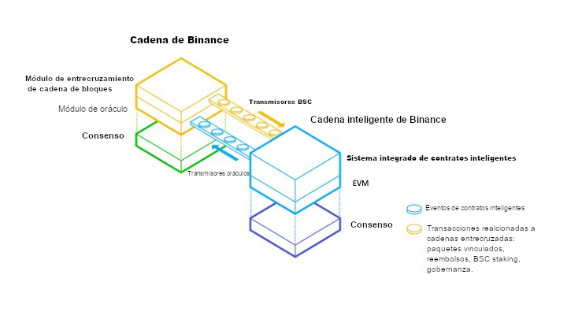

Binance Smart Chain: Una cadena de bloques paralela de Binance orientada a posibilitar Contratos Inteligentes

Versión 0.1

2020/04/17

Traducción:

PhD. Federico Ignacio Viola

2020/11/18

# Motivación

Después de su lanzamiento en la mainnet comunitaria en abril de 2019, Binance Chain ha exhibido una alta velocidad y un diseño de alto rendimiento. El foco primario de la cadena de bloques de Binance, su aplicación nativa descentralizada ("dApp") Binance DEX, ha demostrado baja latencia en correspondencia con su margen de gran capacidad de gestión en poco tiempo de un volumen millonario de transacciones.

Flexibilidad y usabilidad están a menudo en relación inversa respecto del desempeño. Puesto el foco en proveer el espacio conveniente para emitir y negociar activos digitales trae también consigo limitaciones La característica más requerida para la cadena de bloques Binance es la extensibilidad programable o simplemente las funciones de contratos inteligentes y máquinas virtuales. Los emisores y propietarios de activos se esfuerzan para agregar nuevas funciones descentralizadas para dichos activos o para introducir cualquier forma de gobernanza y actividades comunitarias.

A pesar de la alta demanda de introducir la función de contratos inteligentes en la Binance Chain, no se trata de una decisión fácil de tomar La ejecución de un contrato inteligente podría ralentizar la función de intercambio y sumar un factores no deterministas a las negociaciones. Si se pudiera ser tolerante y ceder, la idea más sencilla sería introducir una nueva especificación de máquina virtual basada en Tendermint, basada en el actual protocolo de consenso subyacente y la implementación principal RPC de la Binance Chain. Pero todo esto incrementaría los requerimientos de aprendizajes para todas las comunidades dApp existentes y no sería muy bienvenido.

Proponemos una blockchain que sea paralela a la actual Binance Chain para mantener el alto rendimiento de la blockchain DEX y para respaldar, al mismo tiempo, una función amigable de contratos inteligentes.

# Criterios de Diseño

Después de la creación de la blockchain paralela en el ecosistema de la Binance Chain, dos cadenas de bloques operarán una junto a la otra para proporcionar diferentes servicios. La nueva cadena paralela se llamará "**Binance Smart Chain**" (abreviada **"BSC" para las secciones posteriores**), mientras que la mainnet existente continuará siendo denominada "**Binance Chain**" (abreviada **"BC" para las secciones posteriores**).

He aquí los principios de diseño de la BSC:

1. **Blockchain autónoma**: técnicamente la BSC es una blockchain independiente en vez de una solución de dos capas. La mayoría de las funciones fundamentales, técnicas y comerciales, de la BSC deben ser autosuficientes de manera que puedan funcionar correctamente aún si la BC se detuviera por un breve período de tiempo.
2. **Compatibilidad con Ethereum**: la primera plataforma ampliamente utilizada y funcional de contratos inteligentes es Ethereum. Para sacar provecho de sus aplicaciones que poseen una relativa madurez y de su comunidad, se decide que la BSC sea compatible con la actual mainnet de Ethereum. Esto significa que la mayoría de sus **dApps**, componentes de ecosistema e instrumental funcionarán sobre la BSC y requerirán mínima o ninguna alteración; el nodo BSC requerirá de una especicación y de unas habilidades de operación y ejecución de hardware similar (o apenas superior) para funcionar y operar. La implementación de la BSC deberá permitir que ésta pueda ponerse al día con actualizaciones adicionales de Ethereum.
3. **Consenso y gobernanza implicados en el staking**: el consenso basado en el staking es más amigable con el medioambiente y permite opciones más flexibles para la gobernanza comunitaria. Según lo esperado, este consenso debe permitir un mejor rendimiento de la red respecto de la prueba de trabajo (proof-of-work) plena, es decir, tiempo de bloqueo más rápido y mayor capacidad de transacción.
4. **Comunicación entrecruzada nativa de cadenas de bloques**: tanto BC como BSC se escribirán con soporte nativo para comunicación entrecruzada de cadenas entre las dos blockchains. El protocolo de comunicación debe ser bidireccional, descentralizado y no basado en confianza. Se focalizará en mover activos digitales entre BC y BSC, es decir, tokens BEP2, y llegado el caso, algún otro token BEP introducido con posterioridad. El protocolo debe ocuparse mínimamente de otros items almacenados en el estado de la blockchain, con sólo unas pocas excepciones.

# Consenso y quorum de validación

Basado en los principios de diseño arriba mencionados, el protocolo de consenso en la BSC debe cumplir con los siguientes objetivos:

1. El tiempo de bloqueo debe ser más breve que el de Ethereum, por ejemplo, cinco segundos o incluso menos.
2. Requiere un tiempo limitado para confirmar la finalización de las transacciones, a saber, alrededor de un minuto o menos.
3. No debe tener inflación, la recompensa por bloque se toma de las tarifas de gas y el gas se pagará en BNB.
4. Permite compatibilidad del sistema con Ethereum tanto como sea posible.
5. Provee una red de gobernanza moderna basada en staking.

## Prueba de autoridad participada

Aunque la Prueba de trabajo (Proof-of-Work - PoW) ha sido aceptada como un mecanismo práctico para implementar una red descentralizada, no es amigable con el medioambiente y requiere además un gran número de participantes para mantener la seguridad.

Ethereum y algunas otras redes tales como MATIC Bor, TOMOChain, GoChain, xDAI, usan Prueba de Autoridad (Proof-of-Authority - PoA) o sus variantes en diferentes escenarios, incluidas la testnet así como la mainnet. La PoA proporciona alguna defensa contra el ataque del 51%, con eficiencia mejorada y con tolerancia para un cierto nivel de actores bizantinos (maliciosos o hackeados). Funciona como una opción fundamental fácil de escoger.

Mientras tanto, el protocolo PoA es el más criticado por no ser tan descentralizado como el de PoW, puesto que los validadores, es decir, los nodos que se turnan para producir bloques, tienen todos autoridad y son propensos a la corrupción y a los ataques contra la seguridad. Otras blockchains tales como EOS y Cosmos introducen ambas diferentes tipos de prueba de participación delegada (Delegated Proof of Stake - DPoS) para permitir votar a los tenedores de tokens y elegir el grupo validador. Esto incrementa la descentralización y favorece la gobernanza comunitaria.

Aquí se propone que en BSC se combine DPoS y PoA para consenso, de manera que:

1. Los bloques sean producidos por un grupo limitado de validadores.
2. Los validadores se turnen para producir bloques a la manera PoA, similar a Clique, el motor de consenso de Ethereum.
3. El grupo de validadores sea elejido dentro y fuera en función de una gobernanza basada en la participación.

## Quorum de validación

En la etapa genética, unos pocos nodos de confianza operarán como el grupo de validación inicial. Luego de que comienza la producción de bloques, cualquiera puede competir para unirse como candidato para elegir como validador. El estado del staking decide cuál de los 21 nodos con más alta participación ha de ser el próximo grupo validador y dicho tipo de elección se repetirá cada 24 horas.

**BNB **es el token utilizado para el staking para la BSC.

En orden a permanecer tan compatible como Ethereum y actualizable respecto de futuros protocolos de consenso a ser desarrollados, se opta por que BSC dependa de la **BC **para la gestión del staking (consultar la siguiente sección "Staking y gobernanza"). Hay un **módulo dedicado de staking para BSC en la BC**. Dicho módulo aceptará el BSC staking de los tenedores de BNB y calculará el grupo de nodos con la más alta participación Cada medianoche en tiempo UTC, BC emitirá un mensaje "ValidatorSetUpdate" entrecruzado de cadenas verificable para notificar a la BSC para que actualice su grupo validador.

Mientras se producen bloques adicionales, los validadores de la BSC existentes comprobarán si hay un mensaje "ValidatorSetUpdate" de los que se transmiten periódicamente a la BSC. Si lo hay, actualizarán el grupo validador luego de un **período de época**, es decir, luego de un número predefinido de tiempo de producción de bloques Por ejemplo, si la BSC produce un bloque cada cinco segundos y si el período de época es de 240 bloques, entonces el grupo validador actual comprobará y actualizará el grupo validador para la época siguiente en 1200 segundos (20 minutos).

## Seguridad y finalización

Dado que hay más de ½ * N + 1 de validadores honestos, las redes basadas en PoA generalmente funcionan correctamente y de forma segura. Sin embargo, aún hay casos en los que cierta cantidad de validadores bizantinos podrían incluso lograr atacar la red, por ejemplo, a través de un "[ataque de clones](https://arxiv.org/pdf/1902.10244.pdf)". Para que la BSC sea tan segura como la BC, se incentiva a los usuarios a esperar hasta recibir los bloques estampados por más de los ⅔ * N + 1 de los diferentes validadores De esa maera, se puede confiar en la BSC a un nivel similar de seguridad que el de la BC ya que puede tolerar menos de ⅓ * N de validadores bizantinos

Con 21 validadores, si el tiempo por bloque es de cinco segundos, los ⅔ * N + 1 de los estampados de los diferentes validadores requerirán un período de tiempo de (⅔ * 21 + 1) * 5 = 75 segundos. Cualquier aplicación crítica para BSC tendrá que poder esperar ⅔ * N + 1 para garantizar una finalización relativamente segura. Sin embargo, aparte de tal disposición, la BSC introduce una lógica de **recorte **para penalizar a los validadores bizantinos cuando incurran en **doble firma **o por **inestabilidad**, cuestión que se tratará más adelante en la sección "Staking y gobernanza". Esta lógica de corte expondrá a los validadores maliciosos rápidamente y hará muy difícil un "ataque de clones" o hará que su ejecución sea de un costo económico totalmente inconveniente. Con esta mejora, ½ * N + 1 o incluso una menor cantidad de bloques son suficientes como confirmación para la mayoría de las transacciones.

## Recompensa

Todos los validadores de la BSC en el grupo actual de validadores serán recompensados con **tarifas **de transacción de gas **en BNB**. Como BNB no es un token inflacionario, no habrá recompensas de minería como las que se generan en la red Bitcoin y Ethereum, y la tarifa de gas representa la principal recompensa para los validadores. Como BNB constituye también un token de utilidad con otros casos de uso, delegadores y validadores seguirán aún disfrutando de otros beneficios como tenedores de BNB.

La recompensa para validadores la constituye la tarifa de gas que se recoge por las transacciones en cada bloque. La validadores pueden decidir cuánto devolver a los delegadores que hacen staking de BNB para ellos, de manera de hacer más atractivo el staking con ellos. Cada validador se turnará para producir los bloques con la misma probabilidad (si adhieren al 100% de liveness), por lo que, a largo plazo, todos los validadores estables pueden obtener una recompensa de similar magnitud. Mientras tanto, el riesgo en cada validador podría diferir, lo que conduce a una situación contraintuitiva que consiste en que cuanto más usuarios confían y delegan a un solo validador, obtienen potencialmente menos recompensa. De manera que, razonablemente, los delegadores tenderán a delegar en aquél que tenga menos participaciones siempre y cuando el validador sea todavía de fiar (un validador inseguro conllevaría un riesgo de corte). Finalmente, las participaciones (staking) en todos los validadores tendrá menor variación. Esto evitará efectivamente la concentración del staking y el problema de que el "ganador siempre gana" como sucede en algunas otras redes.

Una porción de la tarifa de gas también irá como recompensa a los "transmisores" encargados de la comunicación entrecruzada de cadenas de bloques. Consultar la sección "Transmisores" más abajo.

# Economía de tokens

BC y BSC comparten el mismo universo de tokens para los tokens BNB y BEP2 Esto determina lo siguiente:

1. El mismo token puede circular en ambas redes y circular entre ellas de manera bidireccional a través de un mecanismo de comunicación entrecruzada de cadena de bloques.
2. La circulación total del mismo token debe ser gestionada a lo largo de las dos redes, es decir que la provisión total efectiva de un token debe ser la suma de la provisión total efectiva del token tanto en la BSC como en la BC.
3. Los tokens pueden ser creados inicialmente en la BSC en un formato similar al ERC20, o bien en la BC como un BEP2 y luego ser creados en la otra. Hay formas nativas que vinculan ambas redes y aseguran la provisión total del token.

## Token Nativo

BNB se ejecutará en la BSC de la misma forma que ETH se ejecuta en Ethereum, de manera que continúe siendo un "token nativo" tanto para la BSC como para la BC. Esto siginifica por lo demás que BNB, utilizado para pagar la mayoría de las tarifas en Binance Chain y Binance DEX, se utilizará ademas para:

1. pagar "gas" para implementar contratos inteligentes en la BSC.
2. hacer staking respecto de validadores BSC escogidos y obtener las recompensas correspondientes.
3. llevar a cabo operaciones entrecruzadas de cadenas de bloques, tales como transferir activos tokens entre BC y BSC.

### Fondo germinal

Ciertas cantidades de BNB serán incineradas en la BC y acuñadas en la BSC durante su etapa de génesis. Este monto se denomina "Fondo germinal", destinado a circular en la BSC después del primer bloque y que será enviado al transmisor (relayer) BC-a-BSC inicial (descrito más adelante) y al grupo validador inicial introducido en la etapa de génesis. Estos BNBs se utilizan para pagar tarifas de transacción en la fase inicial para transferir más BNB desde la BC hacia la BSC a través de un mecanismo entrecruzado de cadena de bloques.

La transferencia entrecruzada de cadena de bloques será discutida en una sección posterior, pero para la transferencia de BC a BSC generalmente se debe bloquear BNB en la BC desde la dirección de origen de la transferencia hacia una dirección de sistema controlado y desbloquear el monto correspondiente del contrato especial hacia la dirección de transferencia en la BSC, o a la inversa, cuando se transfiere de la BSC a la BC, hay que bloquear BNB desde la dirección de origen en la BSC en un contrato especial y liberar el monto bloqueado en la BC desde la dirección del sistema hacia la dirección de destino. La lógica está relacionada con un código nativo en la BC y con una serie de contratos inteligentes en la BSC.

## Otros tokens

BC admite tokens BEP2 y los futuros [tokens BEP8 ](https://github.com/binance-chain/BEPs/pull/69)que son activos nativos transferibles y negociables (una vez enlistados) mediante transacciones rápidas y con un tiempo de finalización inferior a un segundo Mientras tanto, como la BSC es compatible con Ethereum, es lógico admitir tokens ERC20 en ella, los mismos se denominarán aquí "**BEP2E**" (con el nombre real que será introducido por los futuros BEPs potencialmente también abarcará asimismo el BEP8). BEP2E podría ser "mejorado" agregandole algunos pocos métodos para exhibir más información como ser la denominación del token, la definición de precisión decimal y la dirección del propietario que puede decidir el enlace del token (Token Binding) a lo largo de las cadenas. BSC y BC trabajan juntas para garantizar que un token pueda circular en ambos formatos con una provisión total confirmada y ser utilizados en diferentes casos de usos.

### Enlace de Tokens

Los tokens BEP2 serán extendidos en orden a albergar un nuevo atributo que asocie el token con un contrato de token BSC BEP2E, llamado "**enlazador**" (Binder), y el proceso de asociación se denomina "vinculación de tokens".

La vinculación de tokens puede ocurrir en cualquier momento una vez que BEP2 y BEP2E están listos. Los propietarios del token ya sea éste BEP2 o BEP2E no necesitan preocuparse por la vinculación, hasta antes de que realmente quieran usar los tokens en diversos escenarios. Los emisores pueden crear primero tokens BEP2 o primero BEP2E y pueden vincularlos con posterioridad. Por supuesto que se busca incentivar a todos los emisores de BEP2 y de BEP2E a que configuren el enlace poco después de su emisión.

Un procedimiento típico para enlazar BEP2 y BEP2E sería como lo que sigue:

1. Garantizar de que tanto el token BEP2 como el BEP2E existan en cada cadena de bloques con la misma provisión total. BEP2E debería tener tres métodos más que el típico ERC20:

a. symbol(): obtiene el símbolo de token.

b. decimals(): obtiene el número de dígitos decimales del token

c. owner(): obtiene **la dirección del propietario del contrato de vinculación**. Este valor debe ser inicializado en el constructor del contrato BEP2E de manera que la acción de enlace adicional pueda verificar si el enlazamiento obtiene el consentimiento del propietario BEP2E.

1. Decidir la circulación inicial en ambas cadenas de bloques. Dado el supuesto que la provisión total sea *S *, y la expectativa inicial de circulación en la BC sea *K*, en consecuencia el propietario tiene que bloquear S-K tokens en una dirección controlada por sistema en la BC.
2. De manera equivalente, una cantidad *K *de tokens serán bloqueados en un contrato especial en la BSC, el cual se ocupará de las principales funciones de enlazamiento. El mismo es conocido como **TokenHub**. El emisor del token BEP2E debe bloquear el monto *K *de ese token en el TokenHub, resultando en *S-K *tokens para circular en la BSC. De ese modo la circulación total a lo largo de las dos cadenas de bloques permanece como *S*.
3. El emisor de tokens BEP2 envía la transacción de enlazamiento en la BC. Una vez que la transacción es ejecutada con éxito luego de una verificación adecuada:

a. Transfiere S-K tokens a una dirección controlada por sistema en la BC.

b. Se creará un paquete de petición de enlace de entrecruzamiento de cadena de bloques, esperando a que lo transmisores (relayers) lo transmitan.

1. Los transmisores de la BSC pasarán el paquete de petición de enlace de entrecruzamiento de cadena de bloques al TokenHub en la BSC y la correspondiente petición e información se almacenarán en el contrato.
2. El propietario del contrato y sólo él puede ejecutar un método especial de contrato TokenHub, denominado ApproveBind, para verificar la petición de entrelazamiento de manera de calificarla como exitosa. Así se confirmará:

a. que el token no logró el entrelazamiento;

b. el entrelazamiento es para el símbolo apropiado, con la provisión total apropiada y la información sobre los decimales.

c. los bloqueos correspondientes se realizan en ambas redes;

1. Una vez que el método ApproveBind ha sido exitoso, el TokenHub señalará que los dos tokens están entrelazados y asignará la misma circulación en la BSC y propagará dicho estatus de vuelta en la BC. Después de esta confirmación final, la dirección del contrato BEP2E y los decimales se escribirán en el token BEP2 como un nuevo atributo en la BC y los tokens podrán ser transferidos bidireccionalmente entre las dos cadenas de bloques. Si el ApproveBind fracasa, el evento fallido también será propagado de vuelta a la BC para liberar los tokens bloqueados y los pasos arriba nombrados podrán ser más tarde reiterados.

# Comunicación y transferencia entrecruzada entre cadenas de bloques

La comunicación entrecruzada entre cadenas de bloques es la clave fundamental que permite que la comunidad aproveche la estructura de cadena de bloques dual:

- Los usuarios son libres de crear cualquier tipo de tokens, productos financieros y activos digitales en la bSC o en la BC según lo deseen; asimismo,
- Los productos en la BSC pueden ser comerciados y distribuidos de forma manual y programáticamente negociados y puestos en circulación en el ambiente ultra-rápido, amigalbe, estable y de alto rendimiento de la BC; de la misma manera,
- los usuarios pueden realizar estas operaciones a través de una interfaz de usuario y de un variado ecosistema de herramientas.

## Transferencia entrecruzada entre cadenas de bloques

La transferencia entrecruzada entre cadenas de bloques es la forma clave de comunicación entre las dos blockchains. Esencialmente la lógica es:

1. la cadena de bloques de transferencia de salida bloqueará el monto de las direcciones del propietario de origen en una dirección/contrato controlado por sistema.
2. la cadena de bloques de transferencia de entrada desbloqueará el monto de la dirección/contrato controlada por sistema y lo enviará a las direcciones de destino.

El mensaje del paquete de transferencia de entrecruzamiento de cadenas de bloques debería permitirles verificar a los transmisores BSC y a los transmisores oráculo BC:

1. Que una cantidad suficiente de activos de tokens son eliminados de la dirección de origen y bloqueados en una dirección/contrato controlado por sistema en la cadena de bloques de origen. Y que esto puede ser confirmado en la cadena de bloques de destino.
2. Que se libera el monto adecuado de activos tokens de una dirección/contrato controlado por sistema y que se asignan a las direcciones destinadas en la cadena de bloques de destino. Si hay una falla, debe poder ser confirmada en la cadena de bloques de origen, de manera que el token bloqueado pueda ser liberado de vuelta (esto podría acarrear un costo).
3. La suma de la circulación total de los activos de token en las dos cadenas de bloques no cambia luego de que se cumple esta acción de transferencia; no importa si la transferencia es exitosa o no.

La arquitectura de comunicación entrecruzada entre cadenas es como está representada en el diagrama aquí arriba. Para adaptar ambos sistemas heterónomos, el manejo de la comunicación difiere en cada dirección.

## Arquitectura BC hacia BSC

BC es una cadena de bloques de finalización instantánea basada en Tendermint. Validadores con al menos ⅔ * N + 1 del poder total de voto firmarán conjuntamente cada bloque de la cadena. De manera que sea práctico verificar el bloque de transacciones e incluso el valor de su estado a través del tipo de verificación de **Encabezado de Bloque **y de **Prueba de Merkle**. Esto ha sido investigado e implementado como "**Protocolo de cliente-ligero en cadena**", el cual ha sido intensamente discutido en la [comunidad Ethereum](https://github.com/ethereum/wiki/wiki/Light-client-protocol), así como estudiado e implementado para [la comunicación inter-cadenas de Cosmos](https://github.com/cosmos/ics/blob/a4173c91560567bdb7cc9abee8e61256fc3725e9/spec/ics-007-tendermint-client/README.md).

La comunicación desde BC-hacia-BSC será verificada por un "**cliente ligero en cadena**" implementado a través de **contratos inteligentes** BSC (algunos de los cuales estarán "**pre-compilados**"). Luego que algunas transacciones y cambios de estados tienen lugar en la BC, si se define una transacción para activar la comunicación entre cadenas, los **transmisores **crearán y pasarán el mensaje de "**paquete**" entre cadenas y lo enviarán a la BSC como datos en los "contratos de clientes livianos". El cliente liviano verificará el paquete y ejecutará las transacciones si pasa la verificación. La verificación estará garantizada según el siguiente diseño:

1. El estado de bloqueo de la BC se sincronizará con los contratos del cliente liviano en la BSC de cuando en cuando, a través del encabezado de bloque y los pre-commits, para obtener la siguiente información:

a. bloque y hash de la aplicación de la BC que están firmados por validadores.

b. grupo de validadores actual y actualización del grupo de validadores.

1. El valor clave de la cadena de bloques se verificará en función de la prueba de Merkle y de la información que se nombra más arriba en el punto #1.

Después de confirmar que el valor clave es exacto y confiable, los contratos del cliente liviano ejecutarán las acciones correspondientes para los paquetes de cadenas entrecruzadas. Algunos ejemplos de tales paquetes que pueden ser creados de BC-para-BSC son:

1. Entrelazamiento: entrelazado de tokens BEP2 y BEP2E
2. Transferencia: se transfieren tokens luego del entrelazamiento, lo que significa que la circulación disminuirá (será bloqueada) en la BC y aparecerá en el saldo de la dirección de destino en la BSC.
3. Manejo de errores: sirve para manipular cualquier evento de caducidad/falla en la comunicación BSC-hacia-BC.
4. Actualización del grupo de validadores BSC

Para garantizar que no haya duplicaciones, una secuencia de mensajes adecuada y se dé una expiración a tiempo, existe un concepto de "canal" introducido en la BC para manipular cualquier tipo de comunicación.

Para la cuestión de los transmisores, por favor remitirse también más abajo a la sección "Transmisores".

## Arquitectura BSC a BC

BSC utiliza el protocolo de consenso de Prueba de Autoridad Participada, el cual tiene la posibilidad de bifurcación (fork) y requiere confirmación de más bloques. Un bloque sólo tiene la firma de un validador, de manera que no es conveniente depender de un sólo bloque para verificar los datos de la BSC.

Para aprovechar al máximo el quórum de validación de la BC, se adopta una idea similar a muchas blockchains oráculos o [puente](https://github.com/poanetwork/poa-bridge):

1. Las solicitudes de comunicación de entrecruzamiento de cadenas de la BSC se enviarán y ejecutarán en la BSC en forma de transacciones. La ejecución de la transacción emitira eventos, los cuales se pueden observar y empaquetar en ciertos "**oráculos**" en la BC. En lugar de encabezados de bloque, hashes y pruebas de Merkle, este tipo de paquetes de "oráculo" contiene directamente la información de entrecruzamiento de cadenas para determinadas acciones. Información tal como remitente, destinatario y monto a transferir.
2. Para garantizar la seguridad del oráculo, los validadores de la BC formarán otro quórum de "**oráculos transmisores**". Cada validador de la BC debe ejecutar un **proceso dedicado **en la forma de un oráculo transmisor. Estos oráculos transmisores enviarán y votarán respecto del paquete de comunicación entrecruzada de cadenas, en tanto oráculos, en la BC utilizando las mismas claves de validación. Cualquier paquete firmado según el poder de voto de más de ⅔ * N + 1 de los transmisores oráculos será tan seguro como cualquier bloque firmado por el mismo quorum de los ⅔ * N + 1 del poder de voto de los validadores.

Al utilizar el mismo quórum de validación, guarda tanto el código del cliente liviano como las actualizaciones continuas de bloques en la BC. Dichos oráculos tienen también IDs así como una tipología determinada, para garantizar secuenciación y manipulación adecuada de errores.

## Expiración y manejo de errores

Hay escenarios en los que la comunicación entrecruzada de cadenas falla. Por ejemplo, el paquete enviado no puede ser ejecutado en la BSC debido a algún error de programación en el contrato. **Las lógicas de manejo de un error o una expiración **es utilizada en tales escenarios.

Para los errores de usuario y sistema reconocibles o para cualquier excepción previsible, las dos redes deben rehabilitarse por sí mismas. Por ejemplo, cuando una transferencia de BC hacia BSC falla, la BSC comunicará un evento de falla y los oráculos transmisores ejecutarán un reembolso en la BC; cuando una transferencia de BSC hacia BSC falle, la BC emitirá un paquete de reembolso para ser enviado por los transmisores para desbloquear los fondos.

Sin embargo, errores o excepciones imprevistas podrían todavía ocurrir en cualquiera de los pasos de la comunicación entrecruzada de cadenas. En cuyo caso, los transmisores y los oráculos transmisores se percatarán de que el correspondiente canal de entrecruzamiento de cadenas está atascado en una secuencia determinada. Luego de un período de expiración, los transmisores y los oráculos transmisores pueden requerir una transacción "SkipSequence" y la secuencia atascada será marcada como "Unexecutable". Se generará la alerta correspondiente y la comunidad deberá discutir como manejar dicho escenario; por ejemplo un reembolso a través del espónsor de los validadores o incluso una clarificación de los fondos bloqueados por error durante la siguiente actualización de la red.

## Entrecruzamiento de cadenas de bloques y experiencia de usuario

Idealmente, los usuarios esperan utilizar dos cadenas de bloques paralelas de la misma manera que usan una sola. Lo cual requiere añadir más tipos de transacciones agregadas a la comunicación entre cadenas de manera que esto sea posible, lo cual suma una gran complejidad, un acoplamiento estrecho y una sobrecarga en el mantenimiento. Aquí la BC y la BSC sólo implementan las operaciones básicas en orden a posibilitar el flujo de valor en el lanzamiento inicial y dejar la mayor parte de la tarea que concierne a la experiencia de usuario del lado de la UI del cliente, como ser el caso las carteras de criptomonedas (wallets). Por ejemplo una magnífica cartera de criptomonedas debería permitir a los usuarios vender un token desde la BSC directamente en el libro de órdenes DEX de la BC de forma segura.

## Evento de contrato en cadenas de bloques entrecruzadas

Un evento de contrato en una cadena de bloques entrecruzadas (CCCE) está diseñado para permitir que un contrato inteligente active transacciones de cadenas de bloques entrecruzadas directamente a través del código del contrato. Esto es posible en base a que:

1. Los contratos estándar del sistema pueden ser ofrecidos para cumplir con operaciones invocadas por contratos inteligenes generales.
2. Los eventos estándar pueden ser emitidos por contratos estándar;
3. Los oráculos transmisores pueden capturar los eventos estándar y activar las correspondientes operaciones de cadenas de bloques entrecruzadas. Las direcciones (de cuentas) dedicadas y administradas por código pueden ser creadas en la BC y accedidas por los contratos en la BSC, denominadas aquí "dirección de contrato en la BC" (Contract Address on BC - CAoB).

Se implementan varias operaciones estándar:

1. Transferencia de BSC a BC: esto se implementa de la misma manera que una transferencia normal de BSC a BC, sólo que activada a través de un contrato estándar. El monto puede ser transferido a cualquier dirección en la BC, incluyendo la CAoB correspondiente del contrato de origen de la transferencia.
2. Transferencia en la BC: esto se implementa en la forma de una transferencia especial entrecruzada de cadenas, mientras que la transferencia real es desde una CAoB a cualquier otra dirección (inclusive otra CAoB).
3. Transferencia desde la BC a la BSC: esto se implementa como una comunicación de doble pasada entre cadenas cruzadas. La primera pasada se activa por el contrato BSC y se propaga en la BC, para que luego en la segunda pasada la BC comience una transferencia normal entrecruzada de cadenas desde la BC a la BSC, desde la CAoB a la dirección de contrato en la BSC. Se debe prestar particular atención al hecho de que el contrato BSC sólo incrementa el saldo a partir de cualquier transferencia entrante en la segunda pasada y el manejo de errores en dicha segunda pasada es el mismo tal como sucede en una transferencia normal desde la BC a la BSC.
4. Negociación IOC (Inmediatamente-o-cancelar): el principal objetivo de transferir activos a la BC es para su negociación. Este evento dará instrucciones para que negociando un cierto monto de un activo en la CAoB se obtenga a cambio otro activo tanto como sea posible y se transfieran los resultados, es decir el origen del que se parte y los tokens de destino producto de la negociación van de vuelta a la BSC. La BC gestionará tales eventos transmitidos enviando un "inmediamente-o-cancelar", es decir una orden IOC a los pares de la negociación, una vez que la coincidencia se cumple, el resultado será reenviado de vuelta a la BSC lo cual podrá ser o bien en uno o bien en otro de los activos negociados.
5. Transacción de subasta: tal evento instruirá a la BC para que envíe una orden de subasta para negociar un cierto monto de un activo en la CAoB con respecto a otro activo tanto cuanto sea posible y transferir de vuelta todos los resultados a la BSC al final de la subasta. La función de subasta está próxima a ser implementada en la BC

Hay ciertos detalles respecto de la negociación:

a.    ambos pueden tener un precio límite (absoluto o relativo) para la negociación;

b.   el resultado final es escribirá como paquetes de cadenas entrecruzada para retransmitirlos a la BSC;

c.     es posible que se cobren tarifas de comunicación entre cadenas entrecruzadas respecto del activo transferido de vuelta a la BSC;

d.    El contrado BSC mantiene una copia en espejo del saldo y los pedidos pendientes en la CAoB. Más allá de cualquier error que pudiera ocurrir durante la transacción, el estado final se propagará de vuelta hacia el contrato de origen y hará efectivo su estado interno.

Con las funcionalidades arriba presentadas, simplemente se agregan las funciones de transferencia e intercambio entrecruzado entre cadenas de bloques con alta liquidez en todos los contratos inteligentes en la BSC. En gran medida se agregarán los escenarios de aplicación en los contratos inteligentes y las dApps, para lograr 1 cadena + 1 cadena > 2 cadenas.

# Staking y gobernanza

La autoridad de la Prueba-de-participación (Proof-of-Stake) acarrea consigo la descentralización y el involucrarse de la comunidad. La esencia de su lógica puede resumirse como sigue: Pueden apreciarse ideas similares en otras redes, especialmente Cosmos y EOS.

1. Los tenedores de tokens, incluyendo a los validadores, pueden hacer que sus tokens estén "**vinculados**" a la participación (stake). Los tenedores de tokens pueden **delegar **sus tokens en cualquier validador o candidato a validador, con la expectativa que éste pueda convertirse realmente en validador; posteriormente pueden elegir un validador diferente o candidato en orden a redelegar sus tokens.
2. Todos los candidatos a ser validadores se ordenarán jerárquicamente según el número de tokens vinculados a ellos y los de más arriba se convertirán en los verdaderos validadores.
3. Los validadores pueden compartir (parte de) su recompensa por la producción de los bloques con sus delegadores.
4. Los validadores pueden sufrir un "**recorte**", es decir un castigo por mal comportamiento, como ser por realizar una doble firma y/o inestabilidad. Dicho castigo será compartido **asimismo por sus delegadores**.
5. Existe un "**período de desvinculación**" para validadores y delegadores de manera que el sistema garantice que los tokens permanezcan vinculados cuando un mal comportamiento es detectado; el responsable sufrirá un "recorte" durante este período.

## Haciendo staking en la BC

Idealmente, dicha lógica de staking y recompensa debería estar integrada en la cadena de bloques y ejecutarse automáticamente en la medida en que se van formando los bloques. Cosmos Hub, el cual comparte la misma forma de consenso que Tendermint y las mismas librerías que Binance Chain, opera de esta forma.

La BC ha sido preparada para habilitar la lógica de staking desde los primeros días de su diseño. Por otro lado, en cuanto la BSC quiere seguir siendo compatible con Ethereum tanto cuanto sea posible, esto conlleva un gran desafío a la vez que un gran esfuerzo para implementar dicha lógica en ella. Esto es así especialmente en cuanto que el mismo Ethereum podría modificar su forma de protocolo de consenso de Proof of Stake en un corto (o largo) plazo. En orden a mantener la compatibilidad y a reutilizar el beneficioso fundamento de la BC, la lógica de staking de la BSC se implementa en la BC:

1. El token para hacer stakin es BNB, en tanto constituye de todas maneras el token nativo de ambas cadenas de bloques.
2. El staking, es decir, tanto la vinculación de tokens como las acciones de delegación y registros de la BSC, tienen lugar en la BC.
3. El conjunto de validadores de la BSC está determinado por su lógica de staking y delegación, mediante un módulo de staking integrado a la BC que sirve a la BSC y que se propaga cada día a las 00:00 UTC desde la BC hacia la BSC mediante comunicación entrecruzada de cadenas.
4. La distribución de recompensas en la BC ocurre todos los días alrededor de las 00:00 UTC.

## Recompensas

Tanto la actualización del validador como la distribución de recompensas ocurre cada día alrededor de las 00:00 UTC. Esto es así para ahorrar el costo de las frecuentes actualizaciones de staking y el costo que implica la distribución de recompensas por la formación de bloques. Estos costos pueden ser significativos en cuanto la recompensa por la formación de bloques se recopila en la BSC y se distribuye desde la BC hacia los validadores y delegadores de la BSC. (Notese que las costos derivados de la formación de bloques en la BC constituirán una recompensa sólo para los validadores de la BC.)

Aquí se introduce deliberadamente un retardo para garantizar que la distribución sea justa:

1. La recompensa por formación de bloques no se enviará al validador de inmediato, sino que será calculada y acumulada en un contrato;
2. Al recibir la actualización del conjunto de validadores en la BSC, se activarán algunas transferencias entrecruzadas entre cadenas para transferir la recompensa a las direcciones de custodia en los validadores correspondientes. Las direcciones de custodia son propiedad del sistema por lo que la recompensa no puede ser gastada hasta que no se haga la distribución prometida a los delegadores. 1 Los inversores de BNB pueden proporcionar otros beneficios a los delegadores de BNB, tanto como lo hacen ahora con los tenedores a largo plazo de BNB.
3. En orden a simplificar la sincronización y a destinar tiempo para dar cabida a los recortes, la recompensa por T-días sólo se distribuirá en T-días+2. Luego que los delegadores obtengan la recompensa, el sobrante se transferirá a la dirección de recompensa propia de los validadores.

## Recortes

El recorte es parte de la forma de gobernanza sobre cadena de bloques, para garantizar que los comportamientos negativos o maliciosos sean castigados. Un recorte en la BSC puede ser emitido por cualquiera. El envío de la transacción requiere **evidencia de recorte **y conlleva costos, pero también brinda una recompensa mayor cuando se cumple con éxito.

Hasta el momento existen dos casos susceptibles de recortes.

### Doble firma

Es una disfuncionalidad bastante grave y muy probablemente una ofensa deliberada cuando un validador firma más de un bloque con la misma altura y el mismo bloque matriz. La implementación del protocolo de referencia ya debería contar con la lógica para prevenir esto, de forma que sólo un código malicioso podría podría desencadenar este tipo de malfuncionamiento. Cuando ocurre un problema de doble firma, el validador debe ser eliminado inmediatamente del del **grupo **de validadores.

Cualquiera puede hacer una solicitud de recorte en la BC con la evidencia de un problema de doble firmado en la BSC; evidencia que debe contener los dos encabezados de bloque con la misma altura y bloque principal, sellados por validadores infractor. Al recibir la evidencia, si la BC verifica su validez:

1. El validador será removido del grupo de validadores a través de una instancia de actualización del grupo de validadores y por una actualización entrecruzada de cadenas.
2. El staking del validador será recortado en un monto predefinido;
3. Parte del monto de BNB recortado será asignado a la dirección del remitente, lo cual constituye una recompensa mucho mayor que el costo de enviar la transacción de solicitud de recorte.
4. El resto del recorte de BNB se asignará a las direcciones de custodia de los otros validadores y distribuido entre todos los delegadores de la misma forma que la recompensa otorgada por la formación de bloques.

### Inestabilidad

La vitalidad de la BSC se basa en el hecho que todos en el grupo de validadores de prueba de participación de autoridad pueden producir bloques a tiempo cuando es su turno. Los validadores pueden perder sus turnos por cualquier motivo, principalmente por problemas de hardware, de software, de configuración o por problemas en la red. Esta inestabilidad de la operación perjudicará el rendimiento de la red e introducirá un mayor grado de no-indeterminación en el sistema.

Puede existir un contrato inteligente interno responsable de registrar las métricas perdidas de bloques de cada validador. Una vez que las métricas están por encima del umbral predefinido, la recompensa por la formación de bloques para el validador no será transmitida a la BC para su distribución, sino que será compartida con otros validadores mejores. De esta forma, el validador operacionalmente disfuncional deberá ser gradualmente eliminado del grupo de validadores mientras que sus delegadores recibirán menos o incluso ninguna recompensa. Si las métricas se mantienen por encima de otras con niveles por encima del umbral, el validador se eliminará de la rotación, lo cual se propagará de vuelta en la BC, donde tendrá lugar otro recorte en el staking del validador.

### Gobernanza de parámetros

Existen muchos tipos de parámetros del sistema para controlar el comportamiento de la BSC como por ejemplo, el umbral de recorte y monto, los costos de transferencias cruzadas entre cadenas, etc. Todos estos parámetros serán determinados por el grupo de validadores de la BSC a través de un proceso de un voto-propuesta basado en el staking de aquellos. Tal proceso se llevará a cabo en la BC y los nuevos valores de los parámetros serán recogidos por el correspondiente sistema de contratos mediante una comunicación entrecruzadas entre cadenas.

# Transmisores

Los transmisores son los responsables de enviar paquetes de intercomunicación cruzada entre las dos cadenas de bloques. Debido a la estructura heterogénea de cadenas paralelas, se han creado dos tipos diferentes de transmisores.

## Transmisores de la BSC

Los transmisores encargados de la comunicación entre la BC y la BSC se denominan "transmisores BSC" o simplemente "**transmisores**". La transmisión es un proceso independiente que puede ser ejecutado por cualquiera y en cualquier lugar, excepto por el hecho que los transmisores deben registrarse ellos mismo en la BSC y depositar una cierta cantidad reembolsable de BNB. La BSC sólo aceptará los solicitudes de transmisión de los transmisores registrados.

El paquete que transmitan será verificado por el cliente ligero de la cadena en la BSC. Una transmisión exitosa requiere atravesar una verificación suficiente y los costos de las tarifas de gas en la BSC, y por lo tanto, tiene que haber incentivos de recompensa que alienten a la comunidad a ejecutar los transmisores.

### Incentivos

Existen dos tipos principales de comunicación:

1. Operaciones de cliente, tales como vinculación cruzada entre cadenas, transferencia y gestión de errores, etc.: esto debe ser pagado por los que solicitan la transacción.
2. Sincronización del sistema, tales como el encabezado de cadena de bloques para verificación y la actualización del conjunto de validadores: lo cual contiene encabezados de bloques y cambios en el grupo de validadores, y debe pagarse por recompensa del sistema de la BSC.

Si algunos transmisores poseen redes más rápidas y mejor hardware, podrían monopolizar todos los paquetes de transmisión y no dejar ninguna recompensa para los otros. Por lo que menos participantes se unirán para la transmisión, lo que fomenta la centralización y perjudica la eficiencia y seguridad de la red. Idealmente, debido a la descentralización y reelección dinámica de los validadores de la BSC, un transmisor difícilmente puede ser seimpre el primero en transmitir cada mensaje. Pero en orden a evitar aún más la monopolización, la economía de recompensas está también especialmente diseñada para minimizar tal posibilidad:

1. La recompensa para los transmisores sólo se distribuirá en lotes, y un lote cubrirá un número de paquetes transmitidos exitosamente.
2. La recompensa que puede obtener un transmisor por la distribuciónd de un lote no es linealmente proporcional al número de paquetes exitosamente transmitidos por él. En cambio, excepto los primeros pocos envíos, cuanto más transmita un transmisor durante el período de un lote, tanto menos recompensa obtendrá. Y el registro también aumentará el costo de dicho monopolio.

## Transmisores oráculo

Los transmisores para la comunicación entre la BSC y la BC están utilizando el modelo de "oráculo", y el así llamado modelo "**oráculos transmisores**". Cada uno de los validadores debe ejecutar transmisores oráculos, y sólo pueden hacerlo aquellos que pertenecen al grupo de los validadores. Cada transmisor oráculo observa el cambio de estado de la BSC. Una vez que capta los paquetes de comunicación de cadenas entrecruzadas, someterá las solicitudes a votación. Luego que los transmisores oráculos, con más de ⅔ del poder de voto de los validadores de la BC, voten por los cambios, las acciones entrecruzadas de cadenas serán realizadas.

Los transmisores oráculo deben esperar la cantidad suficiente de bloques para confirmar la finalización en la BSC antes de hacer el envío y emitir el voto por los paquetes de intercomunicación cruzada entre cadenas en al BC.

Las tarifas de entrecruzamiento de cadenas será distribuida a los validadores de la BC junto con las recompensas normales devenidas de la formación de bloques en la BC.

Este tipo de transmisión oracular depende del respaldo de todos los validadores. En tanto que todos los votos respecto de los paquetes de intercomunicación entre cadenas son registrados en la cadena de bloques, no es difícil tener un sistema métrico para evaluar el rendimiento de los transmisores oráculos. El peor actor podrá recuperar sus recompensas mediante otra lógica de recorte introducida en el futuro.

# Perspectivas

Es difícil arribar a una conclusión respecto de la Binance Chain ya que nunca ha dejado de evolucionar. La estrategia de una cadena dual consiste en abrir la puerta para que los usuarios aprovechen negociaciones y transferencias rápidas, por un lado, y por el otro, para permitir una programación flexible y extensible, pero esto constituirá tan sólo una parada a lo largo del desarrollo de la Binance Chain. A continuación de exponen los temas que se deben analizar en orden a facilitar la mejoría de la comunidad para una mayor usabilidad y extensibilidad:

1. Agregar modelos diferentes de activos digitales para diferentes casos de uso comercial.
2. Permitir una mayor comunicación de datos, especialmente datos de mercado DEX, para que puedan ser comunicados desde el Binance DEX a la BSC.
3. Proporcionar interfaz y compatibilidad para integrarse con Ethereum, incluyendo sus futuras actualizaciones, y con otras cadenas de bloques
4. Mejorar la experiencia del lado del cliente para administrar billeteras y para usar la cadena de bloques de una manera más conveniente.
